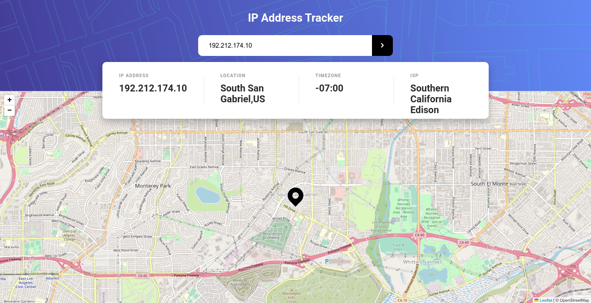
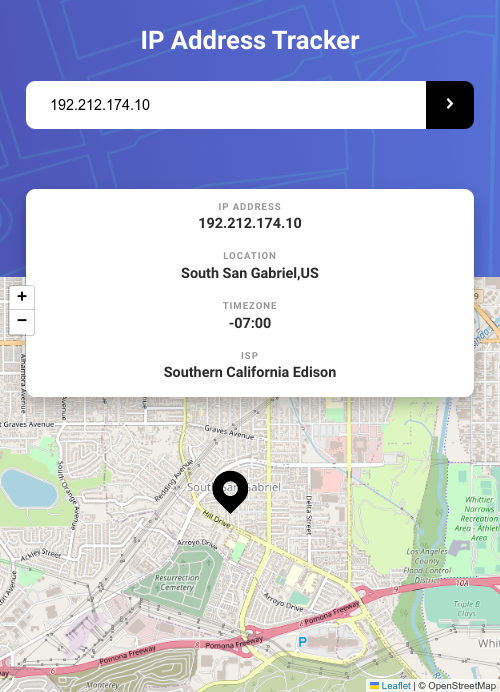

# Frontend Mentor - IP address tracker solution

This is a solution to the [IP address tracker challenge on Frontend Mentor](https://www.frontendmentor.io/challenges/ip-address-tracker-I8-0yYAH0). Frontend Mentor challenges help you improve your coding skills by building realistic projects. 

## Table of contents

- [Overview](#overview)
  - [The challenge](#the-challenge)
  - [Screenshot](#screenshot)
  - [Links](#links)
- [My process](#my-process)
  - [Built with](#built-with)
  - [What I learned](#what-i-learned)
  - [Continued development](#continued-development)
  - [Useful resources](#useful-resources)
- [Author](#author)

## Overview

### The challenge

Users should be able to:

- View the optimal layout for each page depending on their device's screen size
- See hover states for all interactive elements on the page
- See their own IP address on the map on the initial page load
- Search for any IP addresses or domains and see the key information and location

### Screenshot





### Links

- Solution URL: [Github Repo](https://github.com/blaqbox-prime/ip_address_tracker_redux)
- Live Site URL: [IP Tracker](https://fem-iptracker.web.app/)

## My process

### Built with

- Semantic HTML5 markup
- Flexbox
- Desktop-first workflow
- [jest](https://jestjs.io/) - javascript testing library
- [React testing library](https://github.com/testing-library/react-testing-library) 
- [React](https://reactjs.org/) - JS library
- [Redux + React-redux](https://react-redux.js.org/)
- [IPify](https://www.ipify.org/) - IP Address location API


### What I learned

The biggest learning curve here was working with the map. I also tried a little bit of react testing on the Header.jsx component and the IpDetails component. not so extensively tested so I've pushed that lesson to a later project so I can dive much deeper into it and be somewhat able to say 'I can write unit tests in React' 😼


Any and all criticism for this is welcome. I don't know if this could have been done better so, any pointers will be appreciated. Otherwise, this was my best shot at getting this component to work. :}

```js
function Map() {

  const location = useSelector((state) => state);
  const [map, setMap] = useState(null);

 const mapRef = useCallback((mapContainer) => {

    if(mapContainer == null) return;

    mapContainer.innerHTML = '';

    
    const leafmap = new L.map(mapContainer).setView([-26.029744,28.0579063],14);

    L.tileLayer('https://{s}.tile.openstreetmap.org/{z}/{x}/{y}.png', {
    maxZoom: 19,
    attribution: '© OpenStreetMap'
    }).addTo(leafmap);

    setMap(leafmap);

  },[]);

  useEffect(()=>{
    if(map !== null){
      map.setView([location.lat,location.lng]);
      const marker = L.marker([location.lat,location.lng],{
        icon: L.icon({iconUrl :'/images/icon-location.svg',iconSize: [46,56]})
      }).addTo(map)
    }
  },[map,location])

  return (
    <main className="MapContainer" ref={mapRef}>

    </main>
  )
}
```

### Continued development

Working with the map was the biggest pain in my bottom and quite frankly, I don't think it had any business being that difficult, I tried looking at videos for react and leaflet, no help was found there. I looked into react-leaflet, the node package that 'abstracts' leaflet. No help there either. Eventually I looked into a project I did before - Google Docs Clone, and that kind of approach was found useful in getting this to work and make some sense to me. I tried to forced in a little Redux for some practice but I think a different project would be better suited for that. So that will be my next objective. React-Redux and Testing with jest & react testing library.

### Useful resources

- [Leaflet docs](https://leafletjs.com/)
- [Ipify](https://geo.ipify.org/)


## Author

- Website - [Personal Site](https://www.karabosambo.co.za)
- github - [GitHub](https://github.com/blaqbox-prime)
- Frontend Mentor - [@blaqbox-prime](https://www.frontendmentor.io/profile/blaqbox-prime)
- Instagram - [@ig_blaqbox.dev](https://www.twitter.com/ig_blaqbox.dev)
